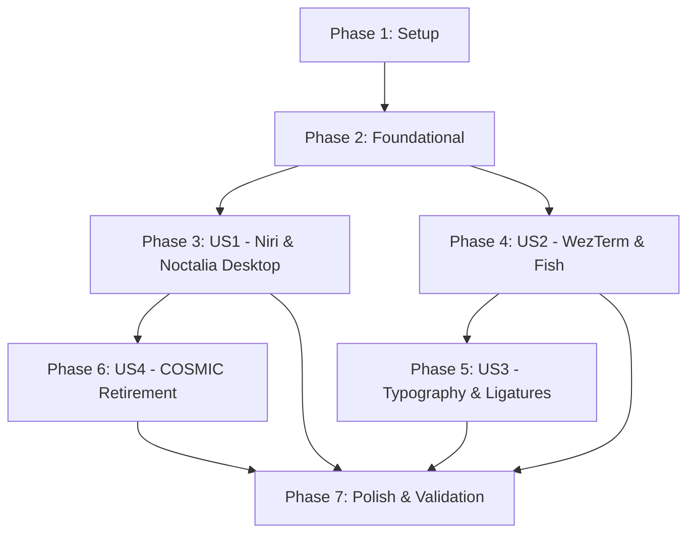

# Tasks: Desktop Environment Migration to Niri and Noctalia (NNN Stack)

**Input**: Design documents from `/specs/004-switch-to-niri-noctalia/`
**Prerequisites**: `plan.md`, `spec.md`, `research.md`, `data-model.md`, `contracts/`, `quickstart.md`, `constitution.md`

## Format: `[ID] [P?] [Story?] Description with file path`

- **[P]**: Can run in parallel (different files, no dependencies)
- **[Story]**: Which user story this task belongs to ([US1], [US2], [US3], [US4])
- File paths are relative to repository root

---

## Phase 1: Setup (Shared Infrastructure)

**Purpose**: Project initialization, upstream dependency declarations, and directory scaffolding

- [X] T001 Declare upstream Noctalia flake input following nixpkgs in flake.nix
- [X] T002 Update flake.lock with pinned Noctalia input via nix flake lock
- [X] T003 [P] Create directory structure for static Niri configuration in modules/home-manager/dotfiles/niri

---

## Phase 2: Foundational (Blocking Prerequisites)

**Purpose**: System-level compositor, display greeter, shell registration, and machine imports that MUST be in place before user-level environments can activate

**⚠️ CRITICAL**: Foundational tasks must complete before user story testing and activation

- [X] T004 Enable Niri Wayland compositor with systemd integration in modules/nixos/desktop.nix
- [X] T005 Configure Greetd display manager with tuigreet session launcher in modules/nixos/desktop.nix
- [X] T006 Enable system-level Fish shell integration in modules/nixos/desktop.nix
- [X] T007 Wire new user modules (niri, noctalia, wezterm, fish) into machines/desktop-pc/configuration.nix

**Checkpoint**: Foundation ready - system-level compositor, greeter, and module wiring in place. User story implementations can proceed.

---

## Phase 3: User Story 1 - Interactive Wayland Desktop Session with Niri & Noctalia (Priority: P1) 🎯 MVP

**Goal**: Deliver a bootable, responsive Wayland desktop session where Niri provides infinite scrollable tiling and Noctalia provides the unified status bar, widgets, and application launcher.

**Independent Test**: Boot or login to workstation, authenticate at tuigreet, verify Niri starts with Noctalia panel visible, open multiple windows, and toggle application launcher via shortcut.

### Implementation for User Story 1

- [X] T008 [P] [US1] Create static Niri KDL configuration with window management keybindings and Noctalia autostart in modules/home-manager/dotfiles/niri/config.kdl
- [X] T009 [US1] Implement Home Manager Niri module linking KDL config in modules/home-manager/niri.nix
- [X] T010 [US1] Implement Home Manager Noctalia module with declarative TOML settings for bar, launcher, and notifications in modules/home-manager/noctalia.nix

**Checkpoint**: User Story 1 (MVP) is fully functional. System boots into Niri with Noctalia shell active.

---

## Phase 4: User Story 2 - Modern Terminal Workflow with WezTerm & Fish Shell (Priority: P1)

**Goal**: Provide WezTerm as the primary GPU-accelerated terminal emulator running Fish shell with instant prompt rendering, autosuggestions, syntax highlighting, and Starship prompt.

**Independent Test**: Press terminal shortcut (Mod+Return), verify WezTerm launches immediately, and confirm interactive Fish shell displays Starship prompt, syntax highlighting, and history autosuggestions.

### Implementation for User Story 2

- [X] T011 [P] [US2] Implement Home Manager WezTerm module with Lua configuration and Wayland backend in modules/home-manager/wezterm.nix
- [X] T012 [P] [US2] Implement Home Manager Fish shell module with interactive options and Starship integration in modules/home-manager/fish.nix
- [X] T013 [US2] Configure WezTerm default program to launch Fish in modules/home-manager/wezterm.nix
- [X] T014 [US2] Update base user shell configuration while preserving POSIX script compatibility in modules/home-manager/base.nix

**Checkpoint**: User Stories 1 and 2 work seamlessly together. Terminal hotkey spawns WezTerm running Fish within the Niri desktop.

---

## Phase 5: User Story 3 - Cohesive Typography with FiraCode Nerd Font & Ligatures (Priority: P2)

**Goal**: Configure FiraCode Nerd Font with active typographical ligatures across both WezTerm terminal and Neovim editor, ensuring consistent symbol rendering and glyph coverage.

**Independent Test**: Open WezTerm and Neovim, view code containing ligature sequences (`!=`, `==`, `->`, `=>`, `<=>`), and verify ligatures render as cohesive glyphs and Nerd Font icons render cleanly.

### Implementation for User Story 3

- [X] T015 [P] [US3] Verify and ensure FiraCode Nerd Font package and fontconfig registration in modules/home-manager/fonts.nix
- [X] T016 [US3] Configure explicit Harfbuzz ligature features (calt, clig, liga) and FiraCode Nerd Font in modules/home-manager/wezterm.nix
- [X] T017 [US3] Configure Neovim nvf typography settings and GUI font in modules/nixos/neovim.nix

**Checkpoint**: User Stories 1, 2, and 3 active. Terminal and Neovim display unified typography and active ligatures.

---

## Phase 6: User Story 4 - Clean Retirement of COSMIC Desktop & Service Hygiene (Priority: P2)

**Goal**: Completely purge COSMIC desktop packages, background services, and greeter configurations to ensure zero residual daemons or resource contention.

**Independent Test**: Execute process check (`pgrep -l cosmic`) on live system to verify zero COSMIC-specific daemons or services remain active.

### Implementation for User Story 4

- [X] T018 [US4] Remove COSMIC desktop manager and cosmic-greeter services from modules/nixos/desktop.nix
- [X] T019 [US4] Remove obsolete desktop imports and unused terminal modules from machines/desktop-pc/configuration.nix

**Checkpoint**: Clean desktop environment with zero lingering COSMIC services and clean process tree.

---

## Phase 7: Polish & Cross-Cutting Concerns

**Purpose**: Code formatting, static linting, hermetic verification, and quickstart scenario validation

- [X] T020 [P] Format all Nix expressions using alejandra via just fmt
- [X] T021 [P] Run static linters (statix check, deadnix) via just lint
- [X] T022 Run hermetic Nix sandbox checks via just check
- [X] T023 Perform dry-run build of desktop-pc system derivation via nix build .#nixosConfigurations.desktop-pc.config.system.build.toplevel --no-link
- [X] T024 Execute quickstart validation scenarios documented in specs/004-switch-to-niri-noctalia/quickstart.md

---

## Dependencies & Execution Order

### Phase Dependencies

- **Setup (Phase 1)**: Can start immediately (no prerequisites).
- **Foundational (Phase 2)**: Depends on Phase 1 completion (inputs and lockfile ready). BLOCKS all user stories.
- **User Stories (Phase 3+)**:
  - **User Story 1 (P1)**: Depends on Phase 2. Foundational desktop MVP.
  - **User Story 2 (P1)**: Depends on Phase 2. Can proceed in parallel with US1 (separate modules).
  - **User Story 3 (P2)**: Depends on US2 (modifies WezTerm and Neovim typography).
  - **User Story 4 (P2)**: Depends on US1 (completes replacement of COSMIC services).
- **Polish (Phase 7)**: Depends on all user story implementations being completed.

---

## Parallel Opportunities

- **Phase 1**: T003 can run in parallel with T001/T002.
- **Phase 3 (US1)**: T008 (KDL config) can be created in parallel with initial module drafts.
- **Phase 4 (US2)**: T011 (`wezterm.nix`) and T012 (`fish.nix`) can be authored completely in parallel.
- **Phase 7 (Polish)**: T020 (`just fmt`) and T021 (`just lint`) can run in parallel before running `just check`.

---

## Implementation Strategy

### MVP First (User Story 1 Only)

1. Complete Phase 1 (Setup: Noctalia input & lockfile).
2. Complete Phase 2 (Foundational: Niri & Greetd system modules).
3. Complete Phase 3 (User Story 1: Niri KDL config & Noctalia Home Manager module).
4. **VALIDATE MVP**: Verify system builds cleanly and launches into Niri + Noctalia desktop.

### Incremental Delivery

1. Foundation + US1 (MVP) → Working scrollable Wayland desktop.
2. Add US2 → WezTerm and Fish shell available via `Mod+Return`.
3. Add US3 → FiraCode Nerd Font with ligatures rendered in WezTerm and Neovim.
4. Add US4 → Complete cleanup and retirement of COSMIC artifacts.
5. Final Polish → Formatting, linting, flake checks, and quickstart validation.
